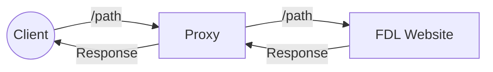

# Table of contents
1. [Introduction](#introduction)
2. [Description](#description)
3. [Background](#background)
	1. [UCX](#ucx)
4. [Final Report](#report)

# Client Server with UCX
In this task, we aim to use the UCX communication framework to implement a client-server application. In this setup, the server functions as a proxy for the [FarDataLab](https://fardatalab.org/) website. The following diagram illustrates the system we plan to develop:

mermaid

Copy code

# Description

In this system, the client sends a request containing a specific path to the proxy server. The proxy processes the request, forwards it to the FarDataLab website, retrieves the website's response, and sends the response back to the client. Make sure the proxied website is a configurable variable.

We recommend starting by implementing a basic client-server application using UCX before moving on to the proxy part. This approach ensures that your client-server implementation works correctly and helps you gain a solid understanding of how UCX works.

The communication between the client and the proxy server should be handled using UCX. The proxy server will then forward the request to the FarDataLab website using standard sockets and OpenSSL. Once the proxy receives the response, it will send it back to the client using UCX again.

# Background

To successfully design and implement a system, it's essential to understand the underlying technologies that facilitate high-performance computation and communication. Here you only need how to work with UCX and Sockets

## UCX - Unified Communication X
UCX is a high-performance, low-latency communication framework designed to unify several communication protocols, including RDMA, TCP, and RoCE. It is widely used for high-performance computing (HPC) and distributed systems, providing a flexible and efficient communication layer.

You can find more about UCX in its offical [documentation](https://openucx.readthedocs.io/en/master/ucx_features.html).

You can also find some exapmle applications implemented using UCX at [this](https://github.com/openucx/ucx/tree/master/examples) link.

# Final Report
In addition to implementing the code, you are required to write a report detailing how your code works. This report should also include some results of your experiments, along with your insights on the outcomes.
